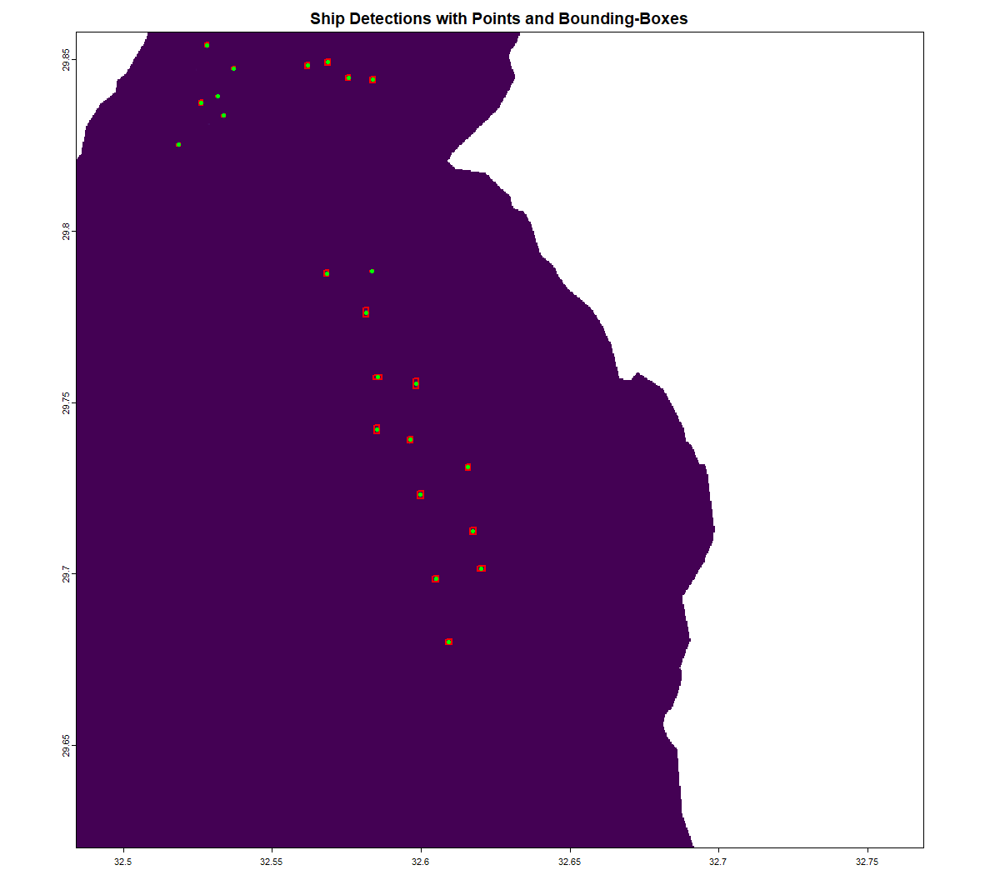

# shipdetectR

**shipdetectR** is an R package for detecting ships in Synthetic Aperture Radar (SAR) imagery.

It uses brightness thresholding, spatial clustering and geometric bounding to isolate potential vessels on open water.

It Supports Sentinel-1 data and uses a shapefile to mask land.

Use terrain-corrected data (e.g., from SNAP). Non-corrected data may cause misalignment unless properly pre-processed.


## Installation

Install from GitHub:

```r
devtools::install_github("clemensschoemig/shipdetectR")
```


## How it works

The ship detection process performs the following steps:

1. Water Masking – Crops SAR raster to water areas using a shapefile.

2. Thresholding – Flags bright pixels above threshold as potential ship pixels.

3. Clustering – Groups neighboring bright pixels in a moving window.

4. Filtering – Removes clusters with fewer pixels than certain threshold.

5. Counting – Labels and counts each ship-like cluster.

6. Bounding Boxes – Generates rectangular bounding boxes around each ship.

7. Centroid Export – Exports center points of bounding box as a shapefile.

The workflow can be executed by the main detect_all_ships() function or each step by using the individual functions.


## Example Output




## Quick Start

The main function `detect_all_ships()` makes it easy to run the full workflow in a single call.
The package includes a built-in example raster and waterbody shapefile.

```r
library(shipdetectR)

results <- detect_all_ships(
  raster_path = system.file("extdata", "package_basis_subset_TC_vh_intensity.tif", package = "shipdetectR"),
  water_shapefile_path = system.file("extdata", "iho.shp", package = "shipdetectR"),
  window_size = 15,                           # Size of the local window for clustering
  min_cluster_size = 50,                      # Minimum pixels required to define a ship
  output_path = tempfile(fileext = ".shp"),   # Save to a temporary file
  export = TRUE,                              # Export ship centroids as a shapefile
  plot_results = TRUE                         # Show plots during processing
)

# Optional: Save output permanently instead
# output_path = "C:/your_filepath/ship_centroids.shp"

```


## Functions

| Function                | Description                                              |
|-------------------------|----------------------------------------------------------|
| `mask_to_water()`       | Masks SAR raster using a waterbody shapefile            |
| `detect_ships()`        | Detects bright pixels based on global intensity threshold |
| `cluster_bright_pixels()` | Applies local pixel clustering using a window matrix  |
| `filter_clusters()`     | Filters out clusters smaller than a set size             |
| `count_ships()`         | Labels and counts ship clusters                          |
| `get_ship_bounding_boxes()` | Builds bounding boxes around labeled ships         |
| `export_ship_points()`  | Calculates and exports ship centroids to a shapefile     |
| `detect_all_ships()`    | Complete detection pipeline combining all steps          |


## Documentation

You can access documentation for each function using the standard `?` syntax in R:

```r
?detect_all_ships
?mask_to_water
```


## Sample Data

The package includes a Sentinel-1 test raster and a water mask for testing:

```
raster_path <- system.file("extdata", "package_basis_subset_TC_vh_intensity.tif", package = "shipdetectR")
shapefile_path <- system.file("extdata", "iho.shp", package = "shipdetectR")
```

The example dataset is based on Sentinel-1 imagery that was terrain-corrected using the SNAP software.


### Data Source

**The Raster data file**: Sentinel-1 Product (Date: 21.03.2021): S1A_IW_GRDH_1SDV_20210321T034449_20210321T034514_037091_045DD0_875A

**Mask Shapefile**: [Marine Regions: Gulf of Suez (IHO Sea Area)](http://marineregions.org/mrgid/4262)


## Dependencies

This package relies on the following R packages:

- [`terra`](https://rspatial.org/)
- [`sf`](https://r-spatial.github.io/sf/)
- [`raster`](https://rspatial.r-universe.dev/)


## Author

Clemens Schömig
GitHub: @clemensschoemig


## License

MIT License © 2024 – Clemens Schömig
